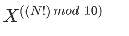

# Factorial equations

You are given two numbers X  and N. Your task is to find the last digit of the following equation:
 

    Input format

        The first line contains integers X.
        Second line contains integer N

    Output format

        Print the last digit of the given equation.

#### Constraints

    SAMPLE INPUT 
        5 
        2
    SAMPLE OUTPUT 
        5
    Explanation
        factorial of (2) is 2*1=2  ,So 5^2=25 the last digit in 25 is 5

Time Limit:	1.0 sec(s) for each input file.
Memory Limit:	256 MB
Source Limit:	1024 KB
